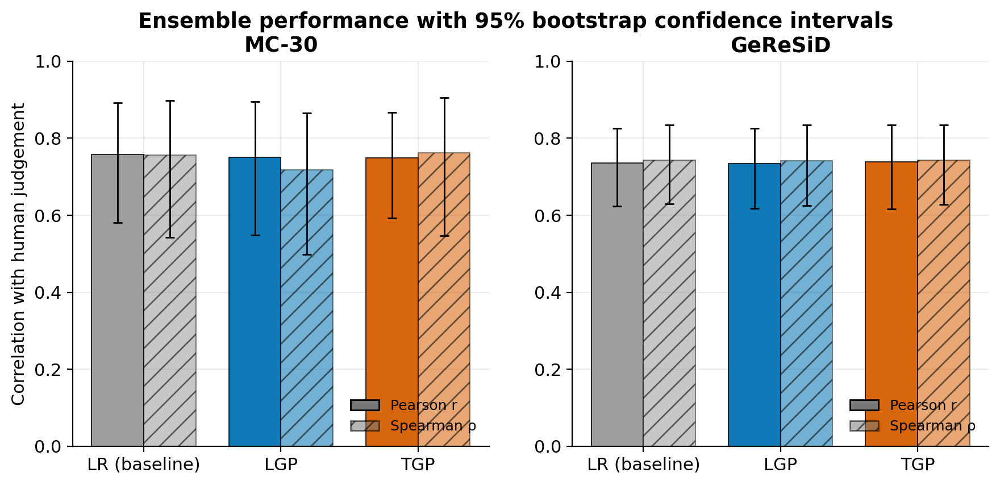

<p align="center">
  <h1 align="center">Semantic Similarity Ensembles with Genetic Programming</h1>
  <p align="center"><em>A reproducible benchmark for evolving and comparing ensemble combinations of semantic similarity measures</em></p>
</p>

<p align="center">
  <a href="https://doi.org/10.1142/S0218194022500772"></a>
  <a href="LICENSE"></a>
  
  
  
  
</p>

> **Keywords:** semantic similarity ensemble · semantic textual similarity · grammatical evolution · genetic programming · sentence similarity benchmark · automatic ensemble learning · text similarity evaluation · similarity measure comparison

This repository accompanies the paper **J. Martinez-Gil (2023), _A Comparative Study of Ensemble Techniques Based on Genetic Programming: A Case Study in Semantic Similarity Assessment_, International Journal of Software Engineering and Knowledge Engineering 33(2): 289–312** ([DOI: 10.1142/S0218194022500772](https://doi.org/10.1142/S0218194022500772)). It has grown from paper-companion code into a small **reproducible benchmarking platform** for semantic similarity ensembles.

---

## What problem does this solve?

**Semantic similarity assessment** measures how close two text units are in meaning. It underpins search, question answering, information retrieval, deduplication, and biomedical text mining. Many systems rely on a *single* similarity measure, when in practice different measures capture different, complementary signals.

This project asks: **can we automatically combine heterogeneous similarity measures into a better ensemble, and which automatic technique should we use?** It treats each similarity measure as a feature and uses **Genetic Programming (GP)** — Linear GP, Tree GP, and Cartesian GP — to evolve an interpretable aggregation function, comparing them against a linear-regression baseline.

### Why semantic similarity ensembles?
No single measure dominates across domains. An ensemble that aggregates several measures can be more robust, and — unlike a hand-tuned formula — an *evolved* ensemble adapts to the data.

### Why genetic / grammatical evolution?
GP searches the space of symbolic aggregation functions and returns a **human-readable expression** (e.g. `(sin(x2) + x2/3)`), not a black box. That makes the resulting ensemble auditable and easy to port into other systems — a property deep ensembles lack.

---

## Reproduce the results with one command

```bash
pip install -r requirements.txt
python -m bench                 # all available methods, all datasets
```

This runs every method on every benchmark dataset and writes, to `results/`:

- **`RESULTS.md`** — a human-readable table with **95% bootstrap confidence intervals**, paired significance tests vs. the baseline, and the evolved expressions;
- **`results.csv`** — tidy machine-readable results;
- **`results.tex`** — a `booktabs` LaTeX table ready to drop into a paper;
- **`figures/`** — publication-quality figures (PNG + PDF).

Every number is computed at run time from the data in `datasets/` — **nothing is hard-coded** — and the run is deterministic for a fixed `--seed` (default `0`).

<p align="center">
  
</p>

> **What the numbers say.** On the small MC-30 and GeReSiD benchmarks shipped here, the linear baseline and the GP ensembles land within ~0.01 of each other in Pearson/Spearman correlation, and the differences are **not statistically significant** (the bootstrap confidence intervals overlap heavily). See [`results/RESULTS.md`](results/RESULTS.md) for the exact figures produced by your own run, and the [paper](https://doi.org/10.1142/S0218194022500772) for the originally reported study. Treat single-dataset gaps with care on benchmarks this small.

### Useful options

```bash
python -m bench --quick              # fast, CI-friendly configuration
python -m bench --datasets mc        # a single dataset
python -m bench --methods lr lgp     # a subset of methods
python -m bench --metric spearman    # optimise/report Spearman
python -m bench --no-figures         # skip plots (no matplotlib needed)
python -m bench --seed 1             # change the random seed
```

---

## Methods

| Method | Paradigm | Library | Interpretable | Status |
|:---|:---|:---|:---:|:---|
| **LR** (baseline) | Linear regression | scikit-learn / NumPy | ✅ | always available |
| **LGP** | Linear Genetic Programming | pure Python (shipped) | ✅ | always available |
| **TGP** | Tree Genetic Programming | `gplearn` | ✅ | needs `gplearn` |
| **CGP** | Cartesian Genetic Programming | `tengp` | ✅ | needs `tengp` |

If an optional dependency is missing, the harness reports that method as **skipped** rather than guessing a number — so results are always honest.

---

## Datasets

| Dataset | Domain | Pairs | Reference |
|:---|:---|---:|:---|
| **MC-30** | General word similarity | 30 | Miller & Charles (1991) |
| **GeReSiD** | Biomedical term similarity | 50 | Garla & Brandt (2012) |

**Evaluation protocol (read this).** In the shipped splits, the training and validation files cover the **same pairs** (the validation gold scores match the training targets; only the feature representation differs). Reported correlations therefore measure **goodness-of-fit on the benchmark pairs**, consistent with the original study — *not* generalisation to unseen pairs. Held-out k-fold evaluation is on the [roadmap](#roadmap).

Adding a dataset is intentionally trivial: drop `datasets/<name>-training.txt` and `datasets/<name>-validation.txt` (same column layout) and register one entry in `bench/datasets.py`.

---

## How do I evaluate a new similarity measure or method?

The harness is built around a tiny adapter interface, so extending it is a few lines.

**A new similarity measure** is just a new feature column in the dataset files — no code needed.

**A new ensemble method** is one `MethodAdapter` in `bench/methods.py`:

```python
def _fit_predict_mymethod(X_train, y_train, X_test, metric, seed, quick):
    model = MyEnsemble(random_state=seed).fit(X_train, y_train)
    return model.predict(X_test), {"expression": model.describe()}

METHODS["mymethod"] = MethodAdapter(
    key="mymethod", label="My Method", paradigm="…", library="…",
    is_available=_always_available, fit_predict=_fit_predict_mymethod,
)
```

It is then picked up automatically by `python -m bench`, including bootstrap CIs, the paired significance test, the report tables, and the figures.

---

## Repository structure

```text
.
├── bench/                       # ⭐ reproducible benchmark harness (this is the platform)
│   ├── datasets.py              #   dataset registry + loader
│   ├── methods.py               #   method adapters (LR, LGP, TGP, CGP)
│   ├── metrics.py               #   Pearson/Spearman + vectorised bootstrap CIs + paired tests
│   ├── runner.py                #   orchestration -> structured results
│   ├── report.py                #   Markdown / CSV / LaTeX writers
│   ├── figures.py               #   publication-quality matplotlib figures
│   └── __main__.py              #   `python -m bench` CLI
├── methods/                     # standalone single-method scripts (LR, LGP, TGP, CGP) + utils
├── datasets/                    # MC-30 and GeReSiD splits
├── results/                     # auto-generated tables + figures (regenerate with `python -m bench`)
├── tests/                       # unit tests (metrics, data contracts, LGP, harness)
├── docs/                        # architecture + benchmarking guide
├── Dockerfile                   # pinned, reproducible environment
└── requirements.txt
```

---

## Reproducibility

- **Deterministic:** fixed seeds for every stochastic method; re-running `python -m bench` reproduces the tables byte-for-byte.
- **Self-describing:** each generated artifact carries a provenance header (UTC timestamp, git commit, seed, library versions).
- **Containerised:** `docker build -t simbench . && docker run --rm -v "$PWD/results:/app/results" simbench` runs the whole benchmark in a pinned environment.
- **Honest by construction:** the harness only reports numbers it computes; missing optional methods are skipped, never fabricated.

---

## Roadmap

Contributions are welcome on any of these — see [CONTRIBUTING.md](CONTRIBUTING.md).

- [ ] Held-out **k-fold cross-validation** mode (`--cv`) for generalisation estimates.
- [ ] Additional standard STS benchmarks (e.g. SICK, STS-B) with automatic downloaders.
- [ ] Sentence-embedding and transformer/LLM-embedding baselines as extra feature sets.
- [ ] A grammar-driven (grammatical evolution) ensemble adapter.
- [ ] A published leaderboard generated from `results/`.

---

## Related work & research context

This sits at the intersection of **evolutionary computation** and **NLP**. It may be relevant to work on: semantic textual similarity (STS) and sentence embeddings; ensemble learning and stacking for NLP; genetic programming and symbolic regression for feature construction; biomedical / clinical NLP; and explainable AI (the evolved ensembles are natively interpretable).

---

## Citation

If this repository or benchmark is useful in your research, please cite:

```bibtex
@article{martinezgil2023c,
  author  = {Jorge Martinez-Gil},
  title   = {A Comparative Study of Ensemble Techniques Based on Genetic Programming:
             {A} Case Study in Semantic Similarity Assessment},
  journal = {Int. J. Softw. Eng. Knowl. Eng.},
  volume  = {33},
  number  = {2},
  pages   = {289--312},
  year    = {2023},
  doi     = {10.1142/S0218194022500772},
  url     = {https://doi.org/10.1142/S0218194022500772}
}
```

## Contributing

Contributions, new methods, and new benchmark datasets are welcome — see [CONTRIBUTING.md](CONTRIBUTING.md) and [`docs/benchmarking.md`](docs/benchmarking.md).

## License

Released under the MIT License. See [LICENSE](LICENSE).
