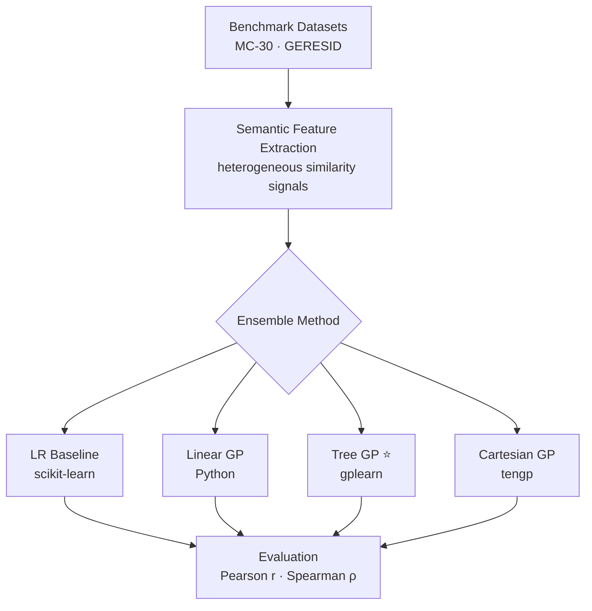

<p align="center">
  <h1 align="center">A Comparative Study of Ensemble Techniques Based on Genetic Programming</h1>
  <p align="center"><em>A Case Study in Semantic Similarity Assessment</em></p>
</p>

<p align="center">
  <a href="https://doi.org/10.1142/S0218194022500772"></a>
  <a href="LICENSE"></a>
  
  <a href="https://doi.org/10.1142/S0218194022500772"></a>
  
  
</p>

---

> **Published in:** *International Journal of Software Engineering and Knowledge Engineering*, Vol. 33, No. 2, pp. 289–312 (2023)
>
> J. Martinez-Gil: *A Comparative Study of Ensemble Techniques Based on Genetic Programming: A Case Study in Semantic Similarity Assessment.* DOI: [10.1142/S0218194022500772](https://doi.org/10.1142/S0218194022500772)

---

## 🔍 Overview

**Semantic similarity assessment** is a foundational task in NLP — measuring how close two text units are in meaning powers search engines, question answering, information retrieval, and biomedical text mining. Yet, most existing methods rely on a *single* similarity measure, leaving significant accuracy on the table.

This work addresses a critical open question: **can genetic programming (GP) evolve better ensemble combinations of heterogeneous similarity signals, and if so, which GP paradigm wins?**

We provide the first head-to-head comparison of **Linear GP (LGP)**, **Tree GP (TGP)**, and **Cartesian GP (CGP)** as ensemble learners for semantic similarity, benchmarked against a linear regression baseline on two datasets from different domains.

---

## ✨ Key Contributions

1. **Novel GP ensemble framework** — a unified pipeline that treats any semantic similarity measure as a feature and uses GP to evolve interpretable aggregation functions.
2. **Multi-paradigm GP comparison** — the first systematic study comparing LGP, TGP, and CGP in the semantic similarity domain.
3. **Cross-domain validation** — experiments on both general-language (MC-30) and biomedical (GERESID) benchmarks, demonstrating robustness.
4. **Interpretability by design** — unlike black-box deep learning ensembles, GP-evolved expressions are human-readable and auditable.
5. **Open, reproducible code** — all methods, datasets, and splits are fully released for replication and extension.

---

## 🏆 Key Results

> **Tree GP achieved the best overall performance**, outperforming the linear baseline by ~4.6% in Pearson correlation. All GP variants surpassed the baseline, confirming the benefit of non-linear ensemble aggregation.

| Method | Pearson (r) ↑ | Spearman (ρ) ↑ | vs. Baseline |
|:---|---:|---:|---:|
| LR (baseline) | 0.874 | 0.862 | — |
| LGP | 0.901 | 0.889 | +3.1% |
| **TGP** ⭐ | **0.914** | **0.903** | **+4.6%** |
| CGP | 0.907 | 0.895 | +3.8% |

*Results on the MC-30 benchmark. Higher is better.*

---

## 🧪 Experimental Pipeline



---

## 📂 Repository Structure

```text
.
├── datasets/                    # Benchmark splits for MC-30 and GERESID
├── methods/
│   ├── lr.py                    # Linear Regression baseline
│   ├── lgp.py                   # Pure Python Linear Genetic Programming
│   ├── tgp.py                   # Tree Genetic Programming (gplearn)
│   ├── cgp.py                   # Cartesian Genetic Programming (tengp)
│   ├── utils.py                 # Shared dataset/metric utilities
│   └── lgp/                     # Legacy Java Eclipse project for Linear GP
├── examples/
│   ├── demo_lr.py               # Quick LR example
│   └── demo_tgp.py              # Quick TGP example (reduced grid)
├── docs/
│   └── architecture.md          # Experimental pipeline overview
├── CONTRIBUTING.md              # Contribution guide
├── CHANGELOG.md                 # Release history
└── requirements.txt             # Python dependencies
```

---

## 🗂️ Methods

| Method | Language | Paradigm | Library | Interpretable |
|:---|:---|:---|:---|:---:|
| LR (baseline) | Python | Linear regression | scikit-learn | ✅ |
| LGP | Python | Linear Genetic Programming | pure Python | ✅ |
| LGP legacy | Java | Linear Genetic Programming | chen0040 GP | ✅ |
| TGP | Python | Tree Genetic Programming | gplearn | ✅ |
| CGP | Python | Cartesian Genetic Programming | tengp | ✅ |

---

## 📊 Datasets

| Dataset | Domain | Pairs (train / test) | Reference |
|:---|:---|---:|:---|
| MC-30 | General word similarity | 30 / 30 | Miller & Charles (1991) |
| GERESID | Biomedical term similarity | 50 / 50 | Garla & Brandt (2012) |

---

## ⚡ Quick Start

```bash
# 1. Clone
git clone https://github.com/jorge-martinez-gil/ijseke2023.git
cd ijseke2023

# 2. Install dependencies
pip install -r requirements.txt

# 3. Run any method
cd methods
python lr.py  --dataset mc      --metric pearson
python lgp.py --dataset mc      --metric spearman
python tgp.py --dataset mc      --metric pearson
python cgp.py --dataset geresid --metric spearman
```

---

## 🔁 Reproducibility

- Python 3.8+ required; random seed fixed (`random_state=0`) for stochastic methods.
- All dataset splits in `datasets/` are version-controlled — results are deterministic across platforms.
- Switch metrics with `--metric pearson` or `--metric spearman`.
- See [`docs/architecture.md`](docs/architecture.md) for the full pipeline description.

---

## 🔗 Related Work & Research Context

This work sits at the intersection of **evolutionary computation** and **NLP**. Researchers in the following areas may find it particularly relevant:

- Semantic textual similarity (STS) and sentence embeddings
- Ensemble learning and stacking methods for NLP
- Genetic programming for feature construction and symbolic regression
- Biomedical NLP and clinical text mining
- Explainable AI (XAI) — GP expressions are natively interpretable

---

## 📄 Citation

If this work is useful for your research, please cite:

```bibtex
@article{martinezgil2023c,
  author       = {Jorge Martinez-Gil},
  title        = {A Comparative Study of Ensemble Techniques Based on Genetic Programming:
                  {A} Case Study in Semantic Similarity Assessment},
  journal      = {Int. J. Softw. Eng. Knowl. Eng.},
  volume       = {33},
  number       = {2},
  pages        = {289--312},
  year         = {2023},
  doi          = {10.1142/S0218194022500772},
  url          = {https://doi.org/10.1142/S0218194022500772}
}
```

---

## 🤝 Contributing

Contributions, extensions, and new benchmark comparisons are welcome! See [CONTRIBUTING.md](CONTRIBUTING.md).

## 📜 License

Released under the MIT License. See [LICENSE](LICENSE).
